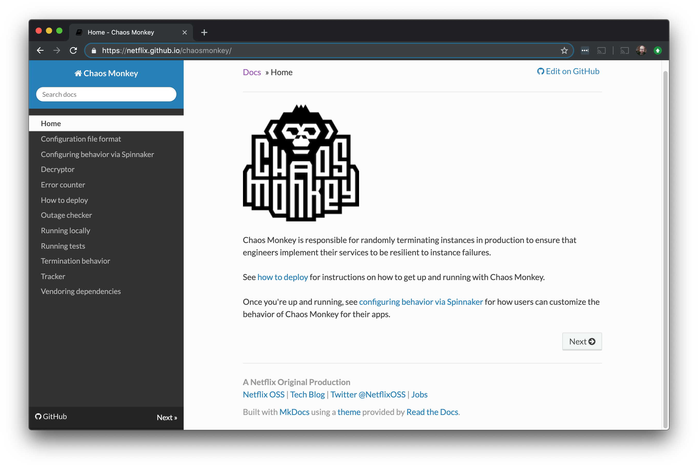

theme: Zurich, 3

# Learning Through Failure

Rich Burroughs
Community Manager
Gremlin, Inc.
@richburroughs

---

^-I started off in the tech industry in the mid 90s, in beautiful Portland, Oregon, working for an Internet Provider

---

^-Was in oncall rotations for about 20 years of my career
-Have a bit of what's called the thousand yard stare

---

#Complexity is constantly increasing

^-Virtualization
-Microservices
-Cloud
-Containers
-Kubernetes
-Service meshes on top of Kubernetes
-The stack keeps growing
-My second tech job was working on a site you might have spent some panicked moments on:

---

^-This is the best screenshot I could find from what the site looked like back then
-I worked there between 1998 and 2000
-It was a very high traffic site on the Internet
-The company was taking out Super Bowl ads and we were dealing with that rush, but the day to day traffic was very high too

---

^-This is what the front end architecture looked like
-Load balancer, 3 big web servers, database and things on the backend
-Before horizontal scaling
-Used to deploy the site
-Take one server out of farm, run scripts, put it back in service
-That's a high traffic site in 1998, compare it to this:

---

^-This is an image of the Netflix microservices architecture
-It's not even current, so if anything things are more complex

---

#What's changed?

^-Complexity has gone up orders of magnitude
-All this complexity makes it harder to learn about systems
-It's also harder to know what's changed

---

^-Let's talk about failure

---

^-How Complex Systems Fail by Richard Cook
-18 points, here are a few

---

#"Catastrophe is always just around the corner"
^-When I started in the industry people thought they could engineer their way out of failure
-"We'll have redundant everything and we'll never go down"
-But failure is inevitable
-As Michael said yesterday we want to have a failure mindset

---

#"Change introduces new forms of failure"

^-He's talking here about adopting new technologies
-New technologies have new failure modes
-The new failure modes may be even worse than the ones you had before

---

#"All practitioner actions are gambles"

^-Here he's talking about uncertainty
-None of us have perfect knowledge of the systems
-When your pager wakes you up at 3AM and you're groggy headed you have the alert message and some other things to go on but you're gambling, like a poker player
-"Successful outcomes are also the results of gambles"
-Several of the points he makes in the paper mention people

---

^-People are an important part of systems
-People specialize and have different areas of expertise

---

^-We all have our own mental models of the system
-The models come from our experience and knowlege
-Example: network engineer

---

#What are some ways we can learn more about systems?

---

^-Documentation
-External docs for open source and proprietary software
-Internal docs like Wikis
-Wikis get stale
-What's worse, you may not even know if they're stale
-What you drew on the white board may not really be how the system works
-So what are some other more effective ways we can learn?

---

^-Using learning tools
-Logan's talk Optimizing Through Learning
-Studying systems with tools like flash cards

---

^-You could do some tabletop roleplaying
-I did this at a previous jobs
-D&D for SREs
-Gamemaster with scenarios, rolled dice
-Practiced responding to the problem, but we also practiced the incident response process itself

---

#Chaos Engineering

---

##"The science of performing intentional experimentation on a system by injecting precise and measured amounts of harm to observe how the system responds for the purpose of improving the system’s resilience."

^-Injecting harm or failure
-Observing how the system responds
-Doing this to improve resilience

---

^-Created in 2010 for move into AWS
-Shut down random hosts
-Netflix has built other tools and contributed a lot to the community
-Amazon and Google had both done failure testing
-When I think of those 3 companies I think of resilient systems

---

#Prerequisites
- Observability
- Blameless Culture

^-logging, monitoring, alerting and metrics
-How we observe what is happening with the system
-This is how we'll see the results of the failures
-Blamelessness: People need to feel like they won't get fired for making a mistake

---

#Scientific Method
- Ask a question
- Research
- Form a hypothesis
- Experiment to test the hypothesis
- Analyze data and draw a conclusion
- Share the results

^-Sharing externally
-Not many people are doing it
-At least 2 reasons: they may not want to publish results that showed they had a problem, and they may view their Chaos Engineering as a competitive advantage
-You should at least share internally with everyone working on the system and stakeholders

---

#Types of attacks
- Shutdown
- CPU
- Memory
- I/O
- Network Latency
- Packet Loss
- DNS
- Blackhole

^-Types of failures we can inject, we call these attacks
-There are others but this gives you an idea what you can do

---

^-Blast radius
-The service or application, and what the impact to users is
-Number of hosts or containers (1 or 1000 hosts)
-Environment (production or staging)
-Start small and expand

---

#The goal is to experiment in Production

^-No other environment will be exactly like it
-Production environments have higher traffic and more data
-Things may be misconfigured in production
-But keep in mind blast radius
-Start in the environment most like production (probably staging)
-As Michael mentioned yesterday, depending on your industry you might not be able to do this, and that's ok

---

^-Abort conditions - what would cause us to stop the experiment?
-Increase in error rate or latency
-moving towards an SLA or SLO violation
-Getting certain alerts from your monitoring
-Corollary is your tool has to have the Big Red Button
-Could be a literal button or a command, but you have to be able to halt all experiments

---

#Example experiment

- Application: Front End
- Attack: CPU
- Hypothesis: Adding CPU load will cause additional hosts to spin up in our Autoscaling Group
- Abort condition: Latency increases by 20%

---

#Example experiment #2

- Application: Front End
- Attack: Blackhole
- Hypothesis: Blackholing the hostname for the Twilio API will cause the SMS transmissions to time out
- Abort condition: Error rate increases by 20%

---

#Don't experiment on things you know are broken

^-Make them resilient first
-This relates to what Michael was talking about with everything being on fire. If your systems aren't somewhat resilient you're not going to get a ton from chaos engineering. But the hope is also that we find problems and correct them.

---

^-Game Days
-Team gets together to run experiments
-People across disciplines
-This is how we improve our mental models
-Looking at how the system works vs what's on the white board
-Onboarding
-Ross mentioned yesterday openness, collaboration and fun

---

#Questions
- Were we able to measure the results?
- Did the system respond the way we expected?
- Are there things we need to fix?

---

#Run experiments to simulate an incident you've had

^-Say you have an incident with network latency
-Have a Game Day and inject latency
-Remidiate the problem and then have another Game Day to see if it worked

---

#What comes after Game Days?

---

#Continuous Chaos

^-Run experiments in CI/CD pipeline
-Here's an example of an integration with Spinnaker
-We still do Game Days
-Chaos tools need an API or some other way to kick them off

---

#Maturity model
- Running manual experiments
- Running experiments using Chaos Engineering tools
- Regularly scheduled Game Days
- Experimenting in Production
- Continuous Chaos

---

#Next steps:

- Join our Chaos Engineering Slack: gremlin.com/slack
- Read tutorials: gremlin.com/community
- Chaos Conf: chaosconf.io
- Gremlin Free: go.gremlin.com/richchaos

---

#Thank you!

Twitter: @richburroughs
Email: richb@gremlin.com

#Slides: https://github.com/richburroughs/dojo201904

^Thanks, hope yougot some ideas on how to learn more about your systems.
We're all on this journey together so let's be friends and help each other

